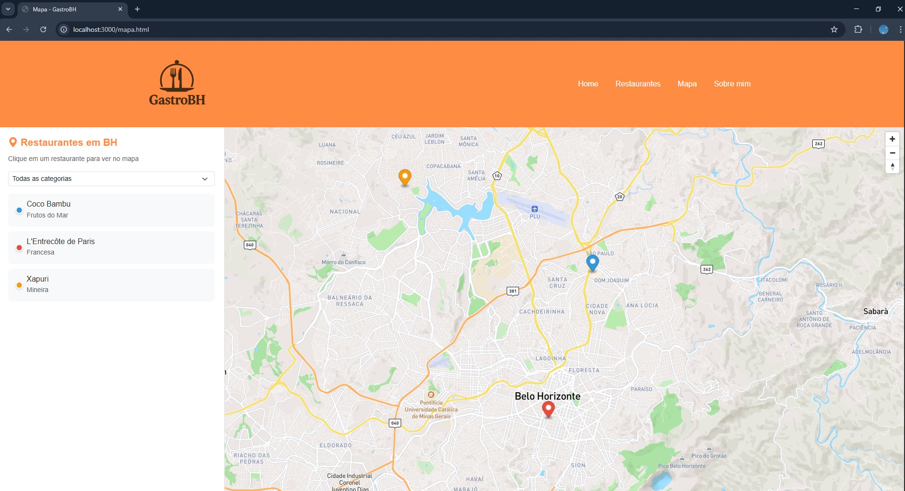
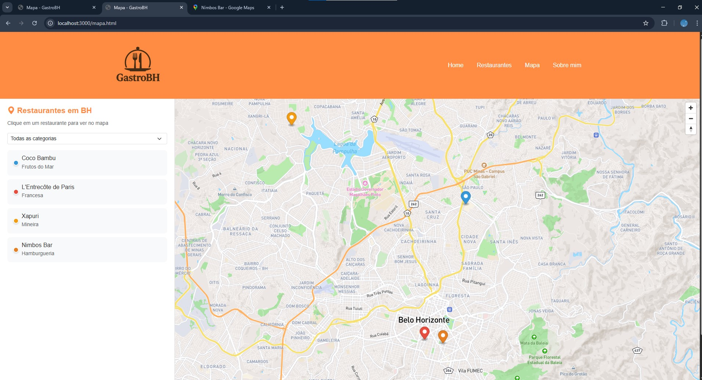
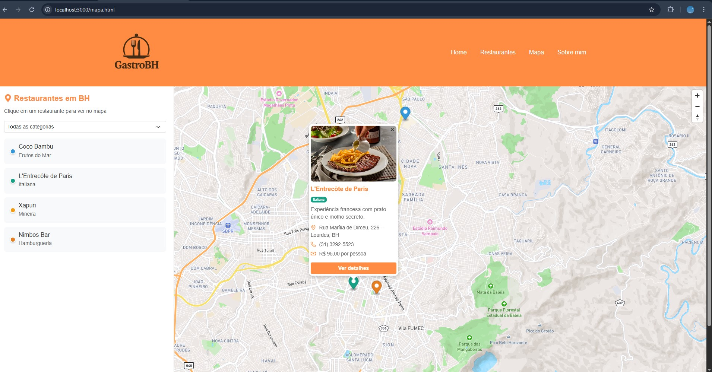

# Trabalho Prático 07 - Semanas 13 e 14

A partir dos dados cadastrados na etapa anterior, vamos trabalhar formas de apresentação que representem de forma clara e interativa as informações do seu projeto. Você poderá usar gráficos (barra, linha, pizza), mapas, calendários ou outras formas de visualização. Seu desafio é entregar uma página Web que organize, processe e exiba os dados de forma compreensível e esteticamente agradável.

Com base nos tipos de projetos escohidos, você deve propor **visualizações que estimulem a interpretação, agrupamento e exibição criativa dos dados**, trabalhando tanto a lógica quanto o design da aplicação.

Sugerimos o uso das seguintes ferramentas acessíveis: [FullCalendar](https://fullcalendar.io/), [Chart.js](https://www.chartjs.org/), [Mapbox](https://docs.mapbox.com/api/), para citar algumas.

## Informações do trabalho

- Nome: Bruna Pedrosa Nunes
- Matricula: 901902
- Proposta de projeto escolhida: GastroBH
- Breve descrição sobre seu projeto: O projeto se trata de um site que visa auxiliar o público de BH a encontrar locais para viver toda a experiência gastronômica que existe na cidade e que muitas pessoas ainda não conhecem.

**Print da tela com a implementação**

Nessa etapa, foi implementada uma tela com um mapa interativo dos restaurantes em Belo Horizonte utilizando Mapbox. Por ela, é possível ver geograficamente todos os restaurantes cadastrados no sistema, além de filtrar por categoria, clicar nos marcadores e navegar diretamente para a página de detalhes.

Foram testadas duas funcionalidade do CRUD:

- Adicinar um restaurante novo 'Nimbos Bar' para aparecer no mapa
- Atualizar a categoria do restaurante L'Entrecôte de Paris para a categoria Italiana de maneira que mude a cor no mapa

Com MapBox implementado:

Adição Nimbos Bar:

Atualização categoria L'Entrecôte de Paris:

